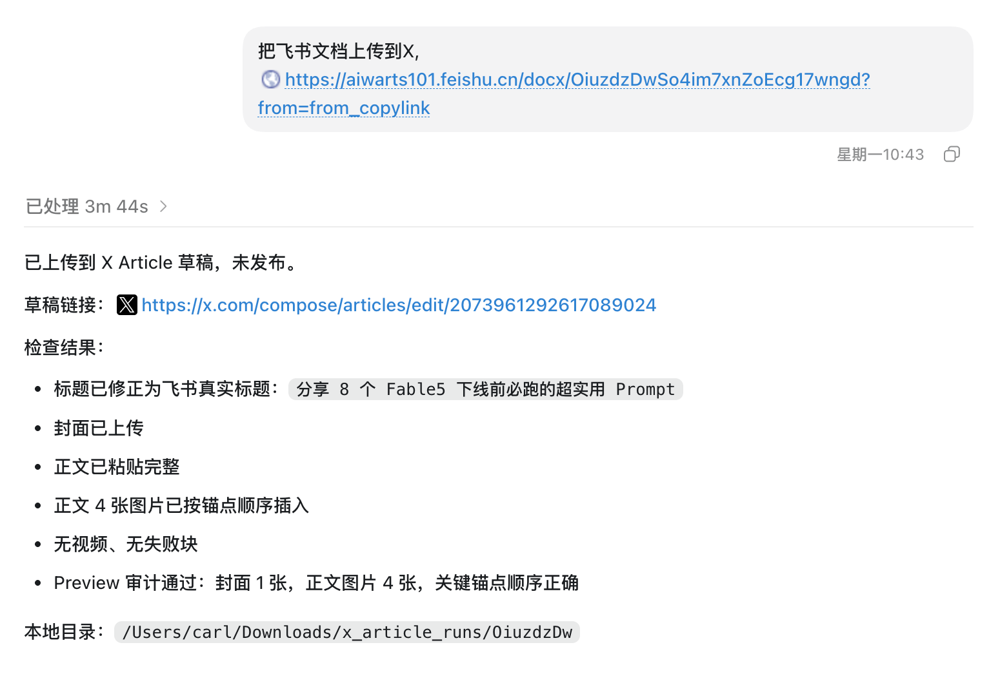

# x-article-publisher


→ [English](README.md)

把飞书文档或本地 Markdown 一键变成 X Article 草稿。视频、图片、GIF 全部自动落回原来的位置。它永远只生成草稿，最后那一下发布键始终握在你自己手里。

如果你曾经花一整晚往 X Article 编辑器里手动重传十几个媒体文件，再把每段视频拖回它该在的段落，这个 skill 能把那个晚上还给你。

## 实际效果

| 发布效果 | 运行记录 |
|:---:|:---:|
|  |  |

一条飞书链接进去，一篇 X Article 草稿出来。3 分 44 秒，零次手动上传。

## 30 秒上手

```bash
npx skills add LearnPrompt/x-article-publisher-skill --skill x-article-publisher --global --copy --yes --full-depth
```

装完打开 Claude Code，说一句话就行：

```
把这篇发布到 X Articles：https://xxx.feishu.cn/docx/abc123
```

本地文件也一样：

```
把 ~/Downloads/my-post.md 做成 X Article 草稿
```

skill 会导出文档、清洗内容、打开持久化浏览器、把草稿一路装配好——封面、标题、正文、每一个媒体按原顺序就位——然后停在发布键前面。你过目，你点发布。

想要一条命令连依赖一起装好的完整 Codex 环境？

```bash
curl -fsSL https://raw.githubusercontent.com/LearnPrompt/x-article-publisher-skill/main/install.sh | bash
```

## 它能干什么

你在飞书写了一篇带 10 个视频和 4 张截图的长文。贴个链接，skill 把所有内容抓出来——包括飞书导出时通常会丢掉的视频——然后在 X 上原样重建，每段视频都锚回它原本所在的段落。

你习惯用本地 Markdown 存草稿。直接指给它 .md 文件，同样的流程，连飞书账号都不需要。

你嵌了一张 18MB 的 GIF。X 不收这个，skill 会先转码成 MP4 再上传。超大视频也是同样的自动处理。

你每周都要发。浏览器 profile 持久化，X 只需要登录一次，之后再也见不到登录页。

## 工作原理


最后一步比看起来重要。所有媒体上传完之后，skill 会拿草稿和源文档整体对账，把漂移的锚点修回去——相邻媒体簇最容易出问题，修复也是按簇级别进行的。

## 实测记录

这些是真实跑出来的结果，没有一条是编的。

| 输入 | 结果 |
|------|------|
| 1 个视频 + 10 张图 | 完整草稿，锚点全部正确 |
| 10 个视频 + 4 张图 | 源文档顺序完整保持 |
| 18MB GIF | 自动转 MP4，干净上传 |
| 相邻媒体簇 | 簇级审计修复漂移 |
| 正文 34 个媒体 | 撞上 X 约 25 个的上限——见下方局限 |

## 环境准备

你需要 X Premium Plus（Articles 功能在它后面）、Python 3.9+ 和 Node.js/npm。飞书模式额外需要 [feishu2md](https://github.com/Wsine/feishu2md) 和一对飞书应用凭证——在飞书开放平台建一个自建应用，给它 docx 读取权限，然后在 shell 里 export `FEISHU_APP_ID` 和 `FEISHU_APP_SECRET`。凭证部分到此为止。

只有首次运行需要你在弹出的浏览器里手动登录一次 X，之后持久化 profile 会接管一切。

不确定环境是否就绪？跑一下体检脚本：

```bash
bash ~/.codex/skills/x-article-publisher/scripts/doctor.sh
```

它会逐项检查依赖并告诉你缺了什么。更多细节在 `docs/GUIDE.md` 和 `docs/TROUBLESHOOTING.md`。

## 诚实的局限

这个 skill 只创建草稿。没有任何参数、任何选项、任何 prompt 能让它自动发布——这是刻意的设计，永远如此。

X 对正文媒体有约 25 个的上限，34 个媒体的文章会丢掉尾部。大视频转码可能要几分钟，视频很多的稿子够你喝杯咖啡。另外 X 偶尔会不报错地忽略某些 PNG，重新导出成 JPEG 通常就好了。

## 仓库结构

```
x-article-publisher-skill/
├── install.sh                    # 一条命令装好一切
├── README.md / README_CN.md
├── scripts/
│   └── clean-local-artifacts.sh
├── docs/                         # GUIDE, TROUBLESHOOTING
├── skills/x-article-publisher/
│   ├── SKILL.md
│   ├── requirements.txt
│   └── scripts/                  # 核心 Python + shell，含 doctor.sh
└── .claude-plugin/plugin.json
```

## 维护状态

2026 年 6 月起进入被动维护。核心流程已 feature-complete，本人每周实际在用；issue 和 PR 尽力处理。

## 致谢

飞书转 Markdown 基础方案：[Wsine/feishu2md](https://github.com/Wsine/feishu2md)

Skill 打包思路参考：[wshuyi/x-article-publisher-skill](https://github.com/wshuyi/x-article-publisher-skill)

## License

MIT
