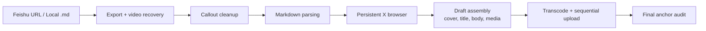

# x-article-publisher


→ [中文版](README.md)

Turn a Feishu/Lark doc or a local Markdown file into a ready-to-review X Article draft. Videos, images and GIFs land exactly where they belong. It never publishes anything on its own — the final click is always yours.

If you have ever spent an evening re-uploading 14 media files one by one into the X Article editor, dragging each video back to the paragraph it belongs to, this skill gives you that evening back.

## Showcase

| Published result | Skill run log |
|:---:|:---:|
|  |  |

One Feishu link in, one X Article draft out. 3 minutes 44 seconds, zero manual media uploads.

## 30-second start

```bash
npx skills add LearnPrompt/x-article-publisher-skill --skill x-article-publisher --global --copy --yes --full-depth
```

Then open Claude Code and say one sentence:

```
Publish this to X Articles: https://xxx.feishu.cn/docx/abc123
```

or with a local file:

```
Turn ~/Downloads/my-post.md into an X Article draft
```

The skill exports the doc, cleans it up, opens a persistent browser, assembles the draft — cover, title, body, every piece of media in order — and stops right before publish. You review, you hit the button.

Prefer a full Codex setup with all dependencies handled for you? One line:

```bash
curl -fsSL https://raw.githubusercontent.com/LearnPrompt/x-article-publisher-skill/main/install.sh | bash
```

## What it does

You wrote a long post in Feishu with 10 videos and 4 screenshots. Paste the URL, and the skill pulls everything out — including the videos that Feishu export normally loses — and rebuilds the article on X with every clip anchored to its original paragraph.

You keep drafts as local Markdown. Point the skill at the .md file and it does the same thing, no Feishu account needed.

You embedded an 18MB GIF. X will not take it, so the skill transcodes it to MP4 before upload. Oversized videos get the same treatment automatically.

You use this every week. The browser profile persists, so you log in to X once and never see the login screen again.

## How it works



The last step matters more than it looks. After every media item is uploaded, the skill audits the whole draft against the source and repairs any anchor that drifted — adjacent media clusters are the usual suspects, and they get fixed at cluster level.

## Field-tested

These are real runs, not synthetic benchmarks.

| Input | Result |
|-------|--------|
| 1 video + 10 images | Complete draft, all anchors correct |
| 10 videos + 4 images | Source order fully maintained |
| 18MB GIF | Auto-converted to MP4, uploaded clean |
| Adjacent media clusters | Drift repaired by cluster-level audit |
| 34 body media items | Hit X's ~25 item ceiling — see limits below |

## Setup

You need X Premium Plus (the Articles feature lives behind it), Python 3.9+ and Node.js/npm. For Feishu mode you additionally need [feishu2md](https://github.com/Wsine/feishu2md) and a Feishu app credential pair — create a self-built app in the Feishu open platform, grant it docx read scope, then export `FEISHU_APP_ID` and `FEISHU_APP_SECRET` in your shell. That is the whole credential story.

First run only: the browser opens X and waits for you to log in manually. After that the persistent profile takes over.

Not sure your environment is ready? Run the doctor:

```bash
bash ~/.codex/skills/x-article-publisher/scripts/doctor.sh
```

It checks every dependency and tells you exactly what is missing. More detail lives in `docs/GUIDE.md` and `docs/TROUBLESHOOTING.md`.

## Honest limits

This skill creates drafts and only drafts. There is no flag, no option, no prompt that makes it auto-publish — that is a design decision, not a missing feature.

X caps body media at roughly 25 items; a 34-media article will lose the tail. Large video transcoding can take a few minutes, so a video-heavy post is a coffee break, not an instant. And X occasionally ignores certain PNG files without any error message — re-exporting as JPEG usually fixes it.

## Repo structure

```
x-article-publisher-skill/
├── install.sh                    # one-command setup
├── README.md / README_CN.md
├── scripts/
│   └── clean-local-artifacts.sh
├── docs/                         # GUIDE, TROUBLESHOOTING
├── skills/x-article-publisher/
│   ├── SKILL.md
│   ├── requirements.txt
│   └── scripts/                  # core Python + shell, incl. doctor.sh
└── .claude-plugin/plugin.json
```

## Maintenance

Passive maintenance as of 2026-06. The core pipeline is feature-complete and in weekly personal use; issues and PRs are handled best-effort.

## Credits

Feishu-to-Markdown baseline: [Wsine/feishu2md](https://github.com/Wsine/feishu2md)

Skill packaging inspiration: [wshuyi/x-article-publisher-skill](https://github.com/wshuyi/x-article-publisher-skill)

## License

MIT

---

<div align="center">

**更多好用 Skill · More Skills** → [learnprompt.pro/skills](https://learnprompt.pro/skills/)

[鲁班·Skill打磨](https://github.com/LearnPrompt/luban-skill) · [庖丁·博主蒸馏](https://github.com/LearnPrompt/paoding-skill) · [蔡伦·对话造纸](https://github.com/LearnPrompt/cailun-skill) · [阿福·LLM Todo](https://github.com/LearnPrompt/afu-llm-todo) · [愚公·Loop工程](https://github.com/LearnPrompt/loop-engineering) · [搭子·结对开发](https://github.com/LearnPrompt/partner-skill) · [AI雷达·零API资讯](https://github.com/LearnPrompt/ai-news-radar)

[淘金小镇·ClawHub日榜](https://github.com/LearnPrompt/skillrush-town) · [Irasutoya·正文配图](https://github.com/LearnPrompt/carl-irasutoya-illustrations) · [Humanize PPT·演讲系统](https://github.com/LearnPrompt/humanize-ppt) · [CC Harness·六件套](https://github.com/LearnPrompt/cc-harness-skills) · [微信读书教练](https://github.com/LearnPrompt/carl-weread) · [X Article发布](https://github.com/LearnPrompt/x-article-publisher-skill)

<sub>**[LearnPrompt](https://github.com/LearnPrompt) 出品** · 公众号「卡尔的AI沃茨」 · [X @aiwarts](https://x.com/aiwarts)</sub>

</div>
